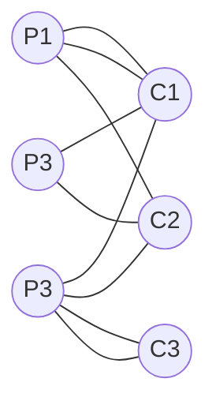

Sommets: les professeurs et les classes 
Arrêtes : 1 arrete = 1 h de cours 

---

---

multi Graphe Biparti 
4 plages horaires ( 4 heures )

---
\\ | 8-9 | 9-10 |10-11 |11-12
--|--|--|--|--
p1| | C2 |C1|C1
p2|C1|C3|C2|
p3|c2|c1|c3|c3

---