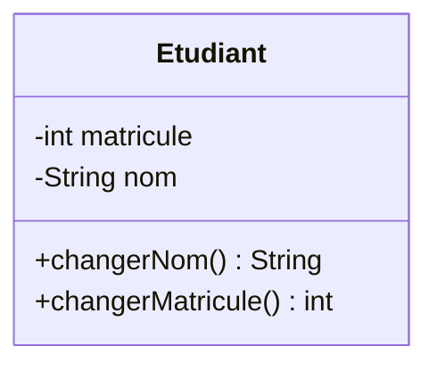
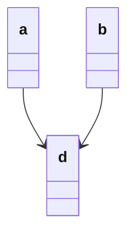

**## Metadata:
* Tags: 
* Course : [[Programmation Java]]
* Started On : 2020-10-16
* Previous Chapter : [[POO- Syntaxe Java]]
* Next Chapter : [[POO- Encapsulation]]
# Slides
![[POO-Classes Et Objets.pdf]]
# Summary
* 2020-10-22 :
	* [x] Exercice 4 TD1- compte rendu -> send to email. 
# POO- Conceptes de bases de la POO
## Conventions 
* Noms 
	* CeciEstUneClasse
	* celaEstUneMethode(...)
	* jeSuisUneVariable
	* JE_SUIS_UNE_CONSTANTE
* Un fichier Par classe, une classe par fichier 
## Classe
* une **classe** est une structure constiutée de 
	* données ou ce qu'on appelle des ***Attributs***
		* Generalement déclarés avec une visibilité ==Private== (çad visibles seulement à l'interieur de la classe elle mêmes, ce qui les rends impossibles a modifier par des methodes externes )
		* sont des variables Globales de la classe ( il est possible que les methodes aient des variables locales ) et sont donc accessibles par toutes les methodes de la classe.
	* Procédures et/ou des fonctions, ce qu'on appelle des ***Methodes***
		* Generalement déclarés avec une visibilité ==Public==




## Objet
* un objet est une instance d'une classe 
	* se conforme à la description que celle ci fournit
	* admet une valeur propre à l'objet pour chaque attribut declaré dans la classe
	* les valeurs des attributs caractérisent l'état de l'objet 
	* possibiliter de lui appliquer toute opération definie dans la classe
* Tout objet est manipulé et identifié par ça reference.

### Affectation et comparaison 
* affecter un objet
	* a=b signifie a devient identique à b

* 
	* les deux objets sont identiques et toutes modifications de l'un entraine la modification de l'autre
* Comparer deux objet
	* a\==b retourne true si les deux objets sont identiques, 
	* càd si les references sont les mêmes, cela ne compare pas les attributs 
### Cycle de vie d'un objet
* Creation ou **Instanciation**
	* usage d'un Constructeur 
		* On peut avoir plusieurs constructeurs par classe, qui ce differencient par leur parametres.
		* le constructeur porte le même nom que la classe, 
		* il existe un constructeur par défaut qui ne possède pas de paramètres utilisé par defaut si aucun autre constructeur avec paramètres n'existe
		* le constructeur effectue certaines initialisation necessaires pour le nouv"el objet crée, en cas du constructeur par defaut tous les attributs sont initialisés avec des valeurs nulles selon le type (0 pour int , null pour un objet).
		```Java
		//creation de constructeur customisé 
		public Voiture (int p){
			puissance = p;
			estDemarre = false;
			vistesse = 0; 
		}
		```
	* l'objet est crée en memoire et les arttributs sont initialisés
	* L'objet crée est une **instance** de la classe 
	* Declaration
		* definit le nom et le type de l'objet
		* un objet seulement déclaré vaut *null*
	* Creation et allocation de la memoire
		* appel de methode de constructeur
		* reserve la memoire et initialise les attributs
	* renvoie une référence vers l'objet crée. 
	```Java
	<Class> obj_ID= new <Constructeur>
	```
* deeterminer la natuer d'un objet: 
 ```Java 
	 c.instanceOf()
```
* Utilisation
	* usage des methodes et des attributs(non recommandé, passage par methodes)
		* ```<reference_objet>.<nomMethode>(<parametres>) ```
	* les attributs de l'objet peuvent être modifiés ( set )
	* les attributs ou leurs dérivés peuvent être consultés ( get )
	>Attention : l'usage d'un objet non cons truit provoque une Exception de type NullPointerException. 
* Destruction et liberation de la mémoire
	* usage (eventuel) d'un Ramasse-Miette (Garbage Collector) qui detruit les objets qui ne sont plus référencés . il fonctionne en permanaence dans un thread de faible priorioté
 
### Les Accesseurs
* des methodes qui peuvent recuperer ou modifier les contenus des attributs 
	* getNomAttribut() : accès en lecture (sans modification)
	* setNomAttribut(\<type> nouvelleValeur): accès en ecriture

### les Tableaux 
* un tableau est composé d'un nombre determiné de variables d'un mem type (primitif ou objet) le Cellules non initialisées contiennent 0 pour les types primitifs et null pour les objets
	* **declaration: **: \<type>\[] nomTableau
	* **Creation** : nomTableau = new \<type><\[taille]
* l'initialisation d'un tableau peut se faire avec une liste statique : 
	* int monTableau = {1,2,3,4,5}
* l'indexation des tableaux commence à partir de 0; 
* l'accès à la case specifisuque : monTableau\[4]
* pour determiner la taille d'un tableau : attribut length 
	* monTableau.length (derniere case du tableau = monTableau.length-1)
* ***Tableaux a plusieurs dimentions:***
	* is simplement tableau de tableau : 
	* int matrice\[]\[]
	* on peut avoir des lignes de longeures differentes 
 
### Les Chaines de caractères : 
* les chaines de caractères sont des objets de la classe ==String==
* **construction :**
	* a
* un objet concaténé a une chaine de caractères est implicitement converti en string . 
* toute conversion se fait de manière automatique en faisant appel à la methode toString();
* **Methodes de la classe String**
	* int length(): renvoie la longeur de la chaine de caractères
	* int compareTo(String abc) comepare deux chaines de caractères. 
		```java
		string ch1 = "abc";
		string ch2 = " abc"
		System.out.println(ch1.compareTo(ch2)); // retourne 1;
		
		string ch3 = "abe"
		System.out.println(ch1.compareTo(ch3));
		// retourne ASCII(ch1(i))-ASCII(ch3(i));
		// where i is la lettre differente
		
		```
	* boolean equals(Object anObject) compare la chaine a un objet et retourne true en cas d'égalité et false sinon
	* boolean equalsIgnoreCase(Object anObject)
	* char charAt(int i)
	* String substring(int d) : sous chaine depuis l'indice d jusqu'a la fin
	* String substring(int d, int f) : sous chaine depuis d jusqua f
	* boolean startWith(String prefix ) renvoie true si prefix est une prefixe de la chaine
	* boolean endsWith(String suffix)
	* in indexOf(String str) : premiere occurence de str
	* int ilastIndexOf(String str): derniere occurence de str
	* 

___
[[POO- Conceptes de bases de la POO#Metadata|up]]