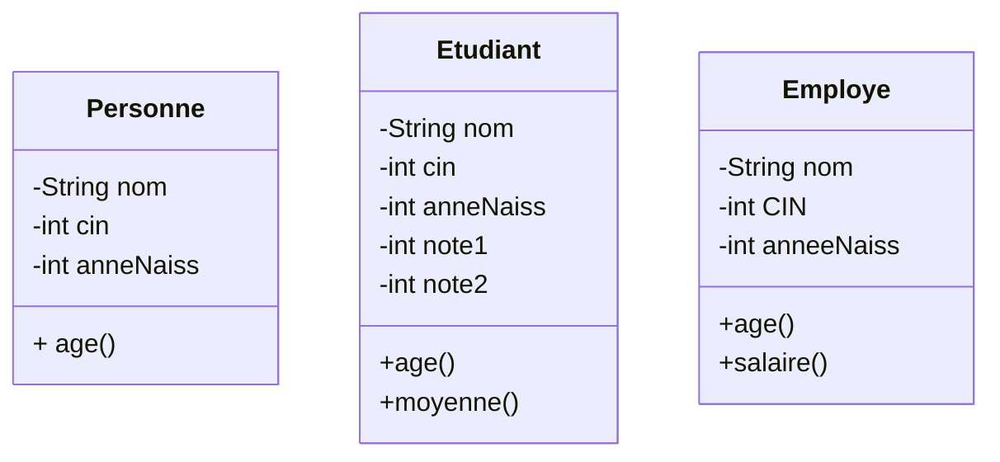
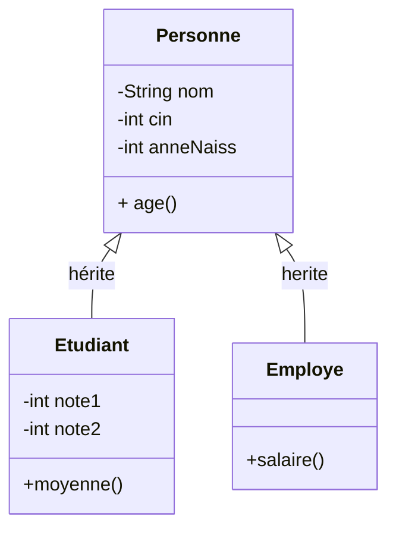
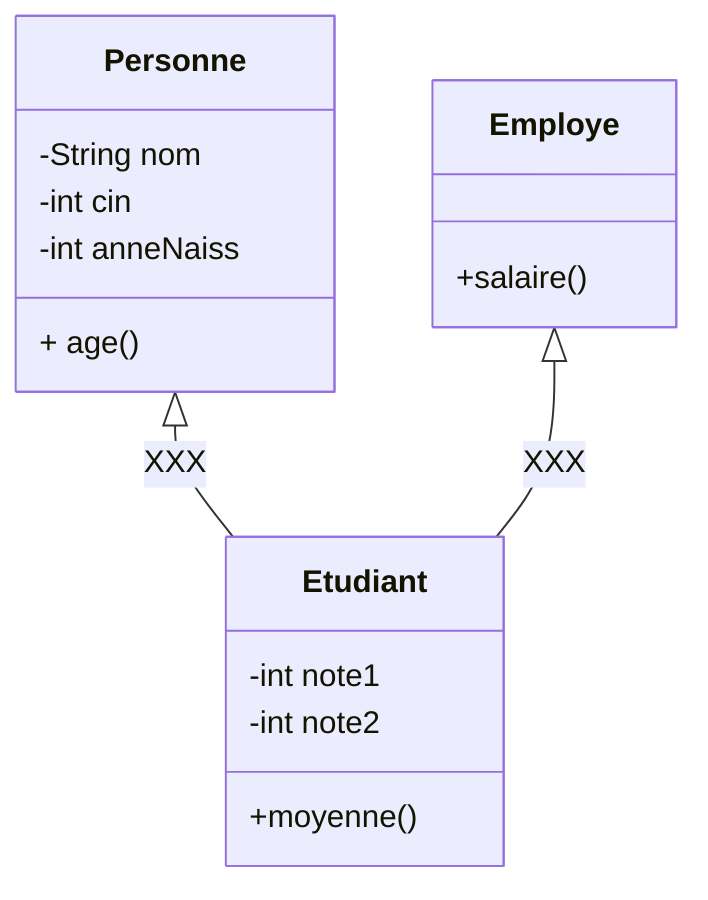
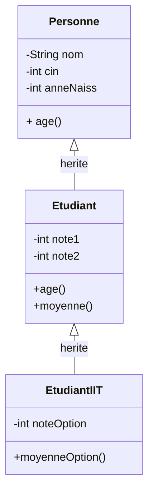

## Metadata:
* Tags: 
* Course : [[Programmation Java]]
* Started On : 2020-11-11
* Previous Chapter : 
* Next Chapter :
# Slides
[[POO-Heritage et Polymorphisme.pdf]]
# Summary
# POO- Heritage et Polymorphisme
## Heritage

Probleme : Des classes qui partagent la totalité des attributs / methodes d'une autre classe fait une ecriture redondante  
=> l'heritage permet d'economiser du code en organisant les classes en hierarchie d'héritage
la superclass( class mere ) donne ces attributs et methodes au classes filles ( sous classe)

on dit que les classes filles hérites de la classe mère 

l'heritage multiple est interdit. 
plusieur classe peuvent heriter d'une sele classe mêre 
mais une classe fille ne peut pas avoir plusieurs superclass

heritage en cascade : 

Etudiant herite de personne
Etudiant iit herite de Etudiant 
=> etudiant iit herite de Personne

Mot clé super
permet d'acceder au attributs et methodes de la superclasss ( kima this but for superclass stuff )

Constructer et heritage

Overwrite (redefinition)
Overload (surcharge)
___
