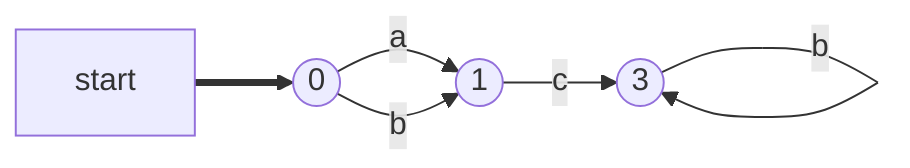
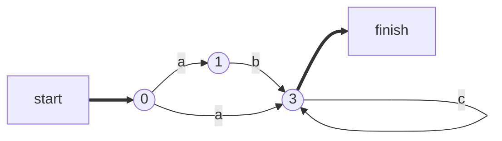

## Metadata:
* Tags: 
* Course : [[Theorie des langages et Automates]]
* Started On : 2020-10-21
* Previous Chapter : [[TLA- Les Langages Régulier et les expressions régulières]]
* Next Chapter :
# Slides
# Summary
# TLA- Les Automates finis
* qu'est ce que c'est ?  
	* un modele qui permet de reconaitre les mots d'un langages réguliers
  
## Introduction
## Automates Finis Deterministes
* un ***==Automate d'états Finis Déterministe==*** (AFD) est un 5-uplet M=(E,A,t,i,F) où : 
	* E est un ensemble *finis* détats 
	* A un alphabet (==Alphabet d'entrée==)
	* t une *application* ExA->E (==Fonction de transition==)
		* cette applicateion genere une seule image pour chaque couple (etat, symbole)
	* i in E : ==état initial==
	* F subset or equals E : ensemble des ==états finaux==
		* etats pour lesquels un mot est accépté. 
* **Représentation d'un AFD**:
	* soit M un AFD 
	* On représente M par un [[Theorie des Graphes et Recherche Operationnelle| Graphe Orienté et étiqueté]]
* ***==Fonction de Transition==***:
	* représentée par une **Matrice de Transition** 
	* Utilité d'un ATF en theorie des langages : 
		* L'afid lit le premier symbole s1 du mot w 
		* l'afd va passer à un autre etat , disons e1 tel que t(i,s1)=e1
		* l'afid lit le second symbole S2 du mot w et passe a léetat e2 tel que t(e1,s2)=e2
		* l'afd poursuit ce processus de lecture jusqu'a l'arricée ç un etat en tel que t(en-1, sn) = en
		* l'afd lit donc les n symboles du mot w 
		* si en in F , le mot w est reconnu par l'afd, sinon le mot est refus é
	* **Transition itérée**
		* Application de l'ensemble E x A* -> E definie par : 
			* t*(e,epsilon)=e // condition d'arret
			* t\*(e,w)=t(t\*(e,v),a) pour tout mot w = va ou a in A et 
 	
## Reconaissance des mots par un AFD 
* ***==Reconaissance d'in mot==***
	* Soit M(E, A, T , i , F) un AFD 
	* soit w =s1,s2,sk inA* 
	* on dit que w est reconnu par m si la sequence de transitions correspondant au symboles de w finit a partir de l'etat initial vers l'un des etats finaux de M 
> img 
> * ac
>   1. t(0,a)=1
>   2. t(1,c) = 0 in F
>   3. donc ac est accepté par l'automate 
> * accbb
>   1. t(0,a)=1
>   2. t(1,c)=0
>   3. t(0,c)=2
>   4. t(2,b)=3
>   5. t(3,b)=3 in F donc accepté
> * acb
>   1. t(0,a)=1
>   2. t(1,c)=0
>   3. t(0,b)=1 not in F donc pas accepté
> * acc 
>   1. t(0,a) =1 
>   2. t(1,c) =0
>   3. t(0,c)=2 not in F donc pas accepté
	
Remarque: 
* u x est recoonnu par afd sissi dans le graphe qui represente M il y a un chemin allant de l'état init vers un des etats finaux etiquetés par le symbole. 

> ***THEOREME: Reconnaissance d'un mot***
> soit M (afd), et w un mot sur A ; 
> le mot w est reconnu par M si et seulement si t\*(i,w) in F

## langages reconnus par un afd 
* ***==reconaissance de langages==***:
	* un langage reconnu par M not l(m )

## automates finis non deterministes
* exemple :

* un automate fini non deterministe est un 5-uplet M(E,A,t,i,F)ou
	* E comme deterministe
	* A 
	* t est une application E x A -> P(E) ensemble des parties de E 
==Remarque==: 
* a
* les afd deterministes et non deterministes se représente par un grpahe orienté etiqueté
* la reconaissance de mots par un AFND est identique a celle par un AFD
	* Cependant dans un AFD il ya unicité de la lecture d'un mot
* la lecture cu'n mot par un afnd peut ne pas etre unique( voir meme multiple)
* la regle retenue pour decider su in afnd accepte un mot est l'existence d'au moins une lecture allant de létat initial vers un état final de l'afnd

## algorithmes de reconaissance de mots 
* **Cas d'un AFD**
	* demarrage à l'état initial i. 
	* tant qu'il ya des sybomles non lus, on lit un symbole en entrée ;: de gauche a droite et on cherche la transition correspondante pour aboutir ç l'etat suivant 
	* s'il nya pas de transition le mot est refusé par l'algorithme 
	* lorsque tous les symboles sont lu
		* si on est sur un etat final le mot est accepté 
		* sinon il est refusé
* **Cas d'un AFND**
	* demarrage à l'etat initial 
	* tant qu'il ya des symboles enentrée non lus, on lit un symbole en entrée de gauche a droite et on cherche la transition correspondante pour aboutir à l'etat suivant
		* s'il ny a pas de transittion on revient en arrière ver le croisement et on choisit une autre transition 
		* on repete cette action jsuq'a trouver une transition. 
		* S'il n y a pas de transition le mot est refusé et l'algorithme s'arrete ( cas d'un blocage )
		* s'il y a plusieurs transitions avec le mmeme symbole d'entrée eon prend une arbitrairement. 

## Equivalence AFD AFND
> Theoreme AFD == AFND
> pour tout afnd m il existe un afd m' qui lui est equivalent , c'est à dire que L' reconnu le meme langage que M 

### Algorithme de transformation
* pour chaque etat e' in E' et pour chaque symbole d'entree a in A'
	* conciderer dans M toute sles transitions d'etiquette a issues d'un etat x in e'
* si ce groupe n'est pas encore dans E', créer ce nouvel état e'' et le rajouter a E' .
	* E' <-E' U {e''}
* rajuter la nouvelle transition t'(e',a)=e'' 
* jusqu'a ce que l'ensemble E' devienne stationnaire 

## Langage automatique
>Definition Langage Automatique
>est un langage pour lequel on peut trouver un automate fini complet qui l'accepte totalement
>$L1 \:automatique \:ssi \: \exists M \:un \:AFD\:; \:L(M)=L1$

>theoreme: Construction des langages automatiques 
>Soit A un alphabet alots:
>tout langage reduit a un seul mot sur A est automatique
>le langage A* est automatique
>si L et M sont deux langages automatiques alors 
>    * L inter M est automatique
>    * L+M est Automatique
>    * L\\M est automatique
>    * Lbar est automatique

pour trouver le complémentaire d'un automate complet,  tout etat final devient non final et tout etat non final devient final. C tou :3

>Theoreme tout langage fini est automatique
>Demo : L = {m1....mn}; nmots
>L={m1}u{m2}....u{mn} qui sont automatiques
>par le theoreme de construction L est automatique
>demo 2 : par récurrence. 
___
[[TLA- Les Automates finis#Metadata|up]]