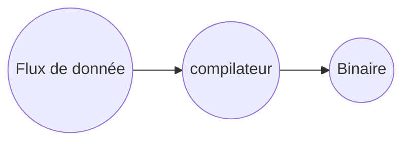
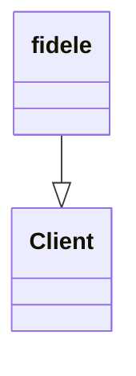

---
#chose 1 of the above, usually Raw, becomes Digested when
# uncomment the line below
tags: Source/lecture_Note/raw
aliases: ["202102091102 LN- C++ 1","LNCPP1"] 
---
<!--topic should reference the big themes of a certain lecture, not necessarily the Title of the Course -->
* Topic:
* Date: 2021-02-09
* Given By:[[@Maher Kamel]]


# Notes 



* Domaines d'utilisation du C++
	* Embarqué 
		* tableau de bords de voitures/ aviant
		* Robotique et mobile
	* Domotique
* code snippets 
```c
	#include <stdio.h>
	int sum(int a, intb){
		return a+b;
	}

	int main(){
		printf(sum(4,5));
		return 0;
	}
```
```c
	#include<stdio.h>
	void Echo(int a){
		printf("%d",a);
	}

	void main(){
		scanf("%d",&a);
		Echo(a;
	}
```

```Java
class client{
 String nom;
	int age;
	public client(String nom,int age){
		this.nom=nom;
		this.age=age;
	}
}
class fidele extends client{
	int argent;
	int nbcom;
	
	public fidele(String nom, int age, int argent, int nbcom){
		super(nom,age);
		this.argent=argent;
		this.nbcom=nbcom;
	}
}
```

(More Syntax [Here](https://mermaid-js.github.io/mermaid/#/classDiagram))


---
[[202102091102 LN- C++ 1#Notes|up]]