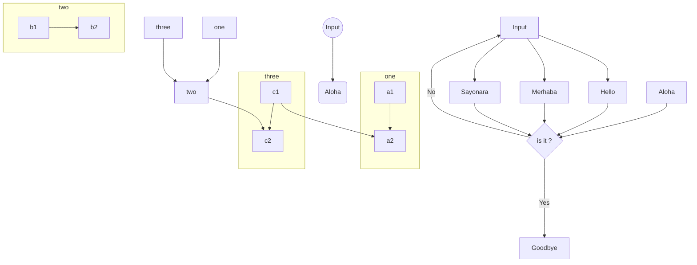

```mermaid
flowchart TD
	c((Input)) --> d(Aloha)
	Input --> Hello
	Input --> Merhaba
	Input --> Sayonara
	
	
	Aloha-->A{is it ?}
	Hello-->A
	Merhaba -->A
	Sayonara -->A
	
	A--Yes ----> Goodbye
	A--No --> Input
	
	c1-->a2 
	subgraph one 
	a1-->a2 
	end 
	subgraph two 
	b1-->b2 
	end 
	subgraph three 
	c1-->c2 
	end 
	one --> two 
	three --> two 
	two --> c2
```
(More Syntax [Here](https://mermaid-js.github.io/mermaid/#/flowchart))