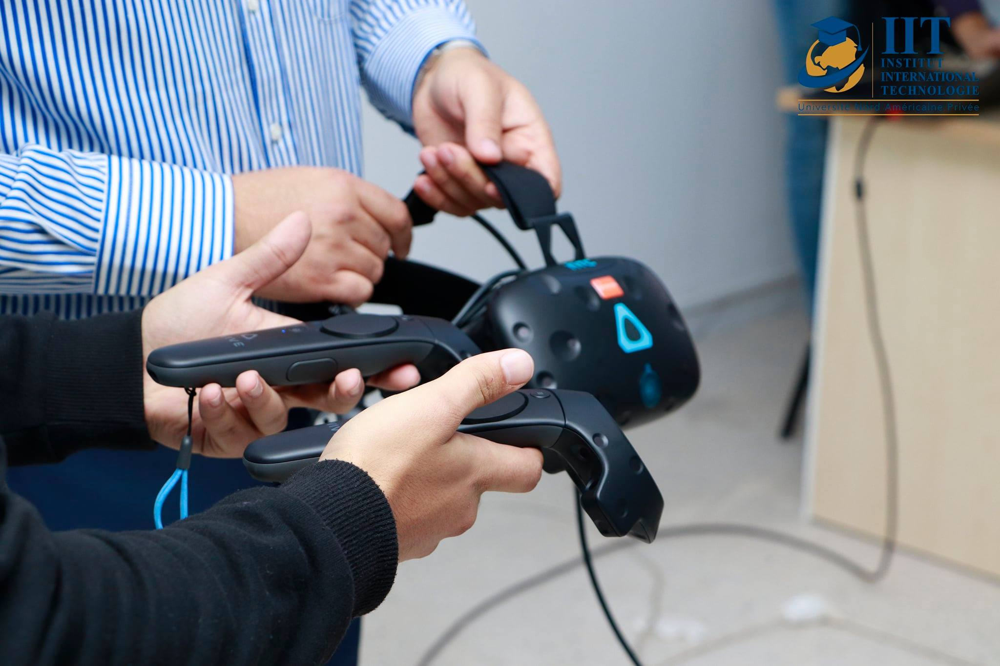
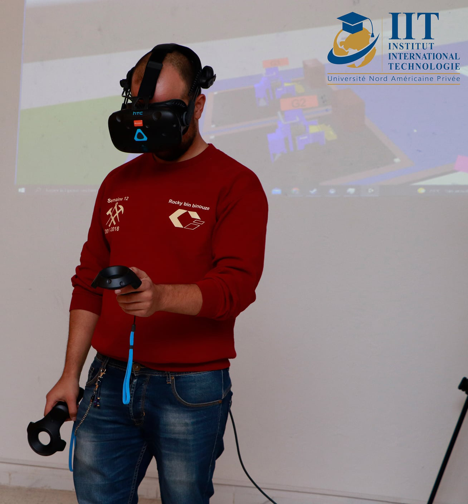
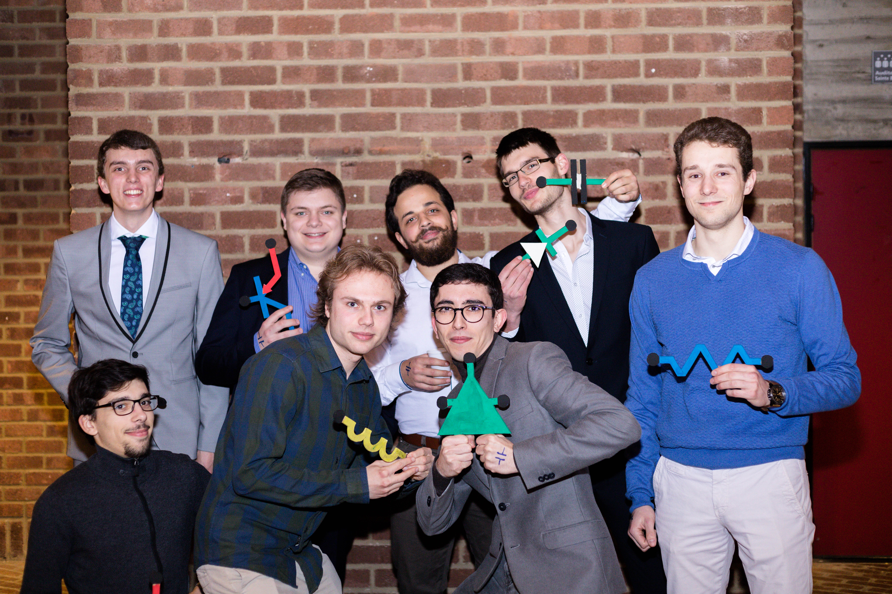
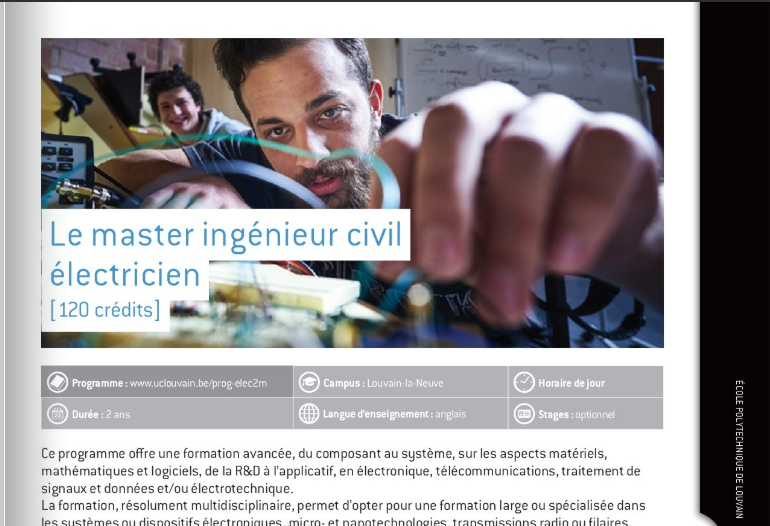
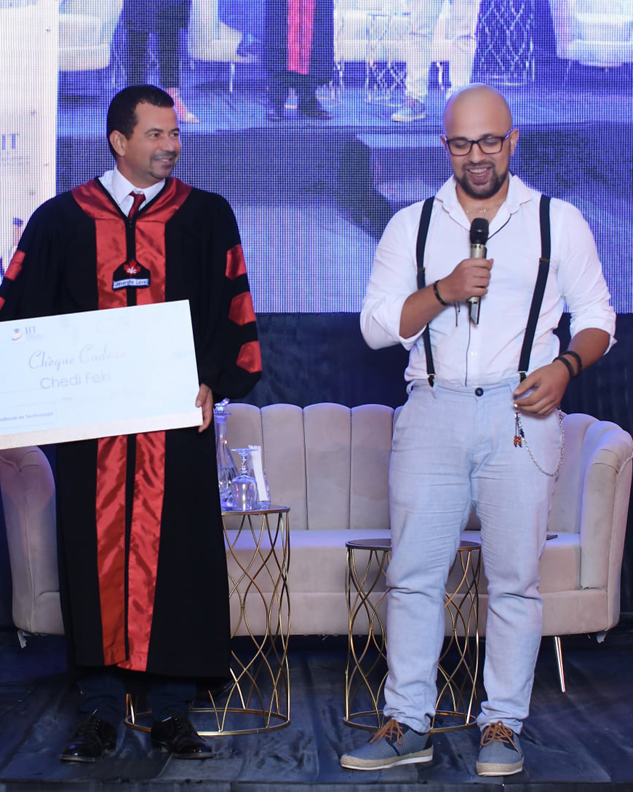
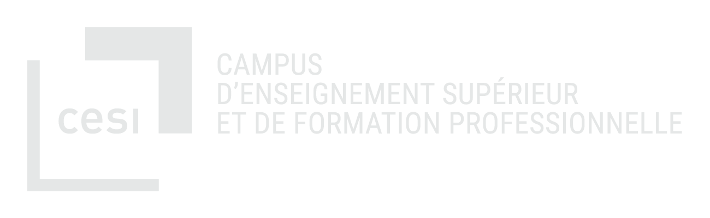
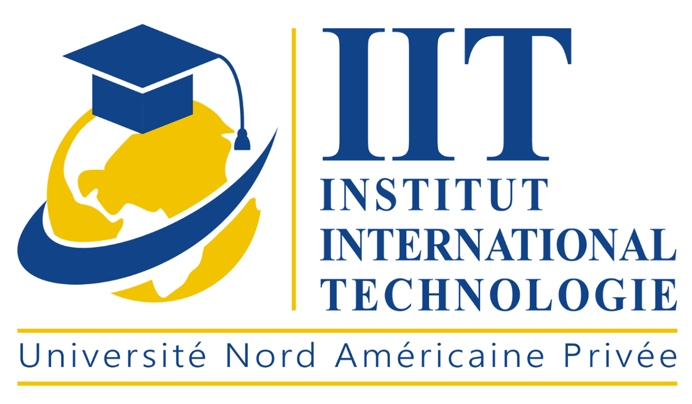

# Réalité Virtuelle : 
## Apports et Enjeux pour l'Industrie du Futur

Présenté par :
 **Chedi Feki**

Le 25 Novembre 2021  

<style scoped>
h1 {
    padding-top: 1.6em;
    text-align: center;
}
h2{
    text-align: center;
}
p{
    padding-top:1.5em;
    text-align: center;
}
</style>
---
# Plan de la Présentation
* Qui suis-je et pourquoi je suis là ??
* Workshop VR
    * La RV kesako ? 
    * Applications industrielles de la RV 
    * Exemples et Demo en directe
* Visite Virtuelle du Nouveau Campus NAPU 

<style scoped>
    h1{
      padding-bottom:1em; 
    }
</style>
---
# Chedi Feki 

* Etudiant
* Développeur de Jeux Video
* Enthousiaste VR/AR
<style scoped>
    ul{
        padding-top : 2em;
    }
</style>
---
# Chedi Feki 

* 2015 - 2019 
Ecole Polytechnique,
 Louvain-La-Neuve, Belgique
    * Bachelor Génie Civil Electronicien 

<style scoped>
     ul{
        padding-top : 1em;
    }
    ul li{
        font-size:24pt;
    }
    ul ul li{
        font-size:24pt;
        color :white;
        padding-bottom : 1em;
    }
</style>
---



---
# Chedi Feki


* Depuis 2019 :
    Institut International de Technologie,
    Sfax, Tunisie 
    * Licence en Génie Logiciel et Systèmes d'Information


<style scoped>
      ul{
        padding-top : 1em;
    }
    ul li{
        font-size:24pt;
    }
    ul ul li{
        font-size:20pt;
        color :white;
        padding-bottom : 1em;
    }
</style>

---
# Workshop RV : 
21-22/10/2021
### Un partenariat
### IIT - CESI



<style scoped>
    h1{
        padding-top: 1em;
    }
    p{
        text-align:center;
        padding-bottom:2em;
    }
    h3{
        text-align : center;
    }
</style>
---
# Workshop RV : 
Assuré Par 

- **Dr Lazher Zaidi**

Professeur Associé, LINEACT CESI 

**PhD** in mechanical and robotic engineering

**Master degree** in Mechatronics, Robotics, and Automation Engineering


<style scoped>
    p{
        font-size:20pt;
    }
</style>
---
# Workshop RV:


---
# Réalité Virtuelle : Késako ? 

---
# Challenges Industriels et apports de la RV

---
# Démos

---
# Merci Pour Votre Attention !
<style scoped> 
    h1{
        padding-top:4em;
        text-align:center;
    }
</style>
---
# dracula 

A Dark theme for [Marp](https://marp.app)

Explore the many features of Marp in style!

*Daniel Nicolas Gisolfi*

<style scoped>
h1 {
    padding-top: 1.5em;
}
</style>


---

# Screen portrayals

| Year | Title | Actor |
| ----------- | ----------- | ----------- |
| 1970 | Jonathan | Paul Albert Krumm |
| 1995 | Monster Mash | Anthony Crivello|
| 2004 | Blade: Trinity | Dominic Purcell|
| 2008 | Supernatural | Todd Stashwick|
| 2020 | Dracula | Claes Bang|

<style scoped>
table {
    margin-left: auto;
    margin-right: auto;
}
</style>

---

# Words from the Source

> There are darknesses in life and there are lights, and you are one of the lights, the light of all lights.
>
> -- Bram Stoker, Dracula

<style scoped>
h1 {
    padding-bottom: 1.5em;
}
</style>

---

# Bats - About

- Small

- Fast

- Mammals

- Scientific name: Chiroptera


---

# Bats - Implementation

```python
class Bat:
    def __init__(name:str, age:int):
        self.__name = name
        self.__age = age
    @property
    def name(self):
        return self.__name
    @property
    def age(self):
        return self.__age
    @property
    def speed(self):
        return 10 - self.age
```


